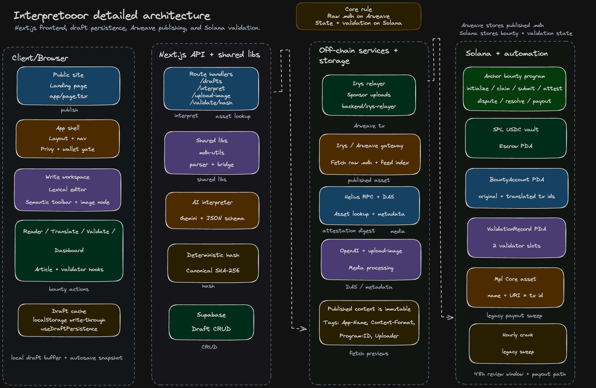

# Interpretooor

<p align="center">
  
</p>

<p align="center">
   
</p>

> The Verifiable, Nuance-Aware Translation Protocol.

[](https://solana.com)
[](https://nextjs.org/)
[](https://arweave.org/)

## Architecture
Interpretooor is organized around a clear split between the Next.js frontend, the semantic `.mdh` content layer, the Irys relayer, and the Solana bounty state on-chain. Writers draft and validate content in the app, the relayer publishes immutable content to Arweave, and Anchor programs keep bounty and validation state on Solana.


## What Interpretooor Does
Interpretooor is a decentralized, cultural-translation protocol designed to ensure that translated content preserves its original meaning, tone, idioms, and intent. Instead of relying on lossy machine translation or unverified manual translation, Interpretooor uses a custom **Semantic Markdown (.mdh)** format to encode cultural context directly into the text.

The protocol bridges human context with decentralized execution:
- **Writers** author rich-text `.mdh` documents and fund translation bounties in USDC.
- **AI Translator** directly translate articles with OpenAI, persistent memory.json, so the AI can self-learn.
- **Validators** stake tokens to review translations and reach consensus on fidelity.
- **Arweave** permanently stores the immutable source and translated material.
- **Kamino** Uses validators stake to deposit into Kamino vault and earn yield. 

## Why Interpretooor is Useful
Traditional translation platforms often strip away the unique cultural nuances of the source text. Machine translation is fast but contextually blind. Interpretooor solves this by combining the speed of AI, the context-awareness of human validators, and the economic guarantees of blockchains.

- **Semantic Fidelity:** The `.mdh` format allows writers to embed hidden semantic tags (e.g., sarcasm, idioms, persuasive intent) that translators and AI must respect.
- **Decentralized Escrow & Yield:** Bounties are locked in a Solana smart contract (Anchor). While funds are escrowed, they are deployed to Kamino Finance to generate continuous APY.
- **Validator Consensus & AI Oracle Fallback:** Translations require double-attestation from staked human validators to pass. If validators dispute a translation, an automated backend oracle (OpenAI) deterministically resolves it.
- **Permanent Availability:** Both the original and translated content are batched and stored immutably on Arweave (via Irys), ensuring no reliance on centralized servers.

## Getting Started

### Prerequisites
- [Node.js](https://nodejs.org/) (v18+)
- [Rust](https://www.rust-lang.org/) & [Solana CLI](https://docs.solana.com/cli/install-solana-cli-tools) (for local smart contract development)
- [Anchor Framework](https://www.anchor-lang.com/docs/installation) (v0.30+)
- A funded Solana Devnet wallet for local deployments.

### Installation

1. **Clone the repository:**
   ```bash
   git clone https://github.com/tayelroy/Interpretooor.git
   cd Interpretooor
   ```

2. **Install dependencies:**
   ```bash
   npm install
   ```
   *Note: This will install dependencies for both the frontend (Next.js) and the `irys-relayer` / `crank` backend services.*

3. **Set up Environment Variables:**
   Create a `.env` file from the example (if available) and fill in your keys (OpenAI, Supabase, Privy, etc.):
   ```bash
   cp .env.example .env
   ```

### Running Locally

To run the full stack locally, you need to spin up the frontend and backend services:

**1. Start the Frontend Application**
```bash
npm run dev
```
The application will be available at `http://localhost:3000`.

**2. Start the Irys Relayer Service** (Terminal 2)
The relayer handles the sponsored upload of files to Arweave.
```bash
cd backend/irys-relayer
npm run dev
```

**3. Start the AI Oracle Crank** (Terminal 3)
The crank automates the dispute resolution mechanism and legacy payout rules.
```bash
cd backend/crank
npm run dev
```

### Smart Contract Deployment
If you make changes to the Solana programs (`anchor/programs/bounty` or `anchor/programs/vault`), rebuild and deploy them to Devnet:
```bash
cd anchor
anchor build
anchor deploy --provider.cluster devnet
```

## Where to Get Help
If you encounter any issues while setting up or using the platform:
- **Issues:** Please check the [GitHub Issues](https://github.com/tayelroy/Interpretooor/issues) page to see if your problem has already been reported.
- **Documentation:** Review the [architecture diagram note](docs/architecture/architecture-diagram.md), `CLAUDE.md`, and the deep-dive documentation in the repository for the architectural overview and codebase structure.

## Maintainers and Contributing
Interpretooor is an open-source project, and contributions are welcome!

### Maintainers
- [@tayelroy](https://github.com/tayelroy)

### Contributing
1. Fork the repository.
2. Create a feature branch: `git checkout -b feature/my-new-feature`
3. Commit your changes. Ensure you follow the established style guide.
4. Push to the branch: `git push origin feature/my-new-feature`
5. Submit a pull request.

Please keep pull requests atomic and ensure your code integrates cleanly with the existing Next.js frontend, AI oracle, and Anchor programs.

---